# DevYard — High Level Design (v2.0 — Complete Architecture)

## 1. Purpose

This document describes DevYard's architecture at the system level: components, their interactions, the four-layer enforcement model, data flow, theme, security, and performance budgets. It bridges the BRD (what) and the LLD (how, file by file).

## 2. Architecture Overview

### 2.1 System context (C4 Level 1)

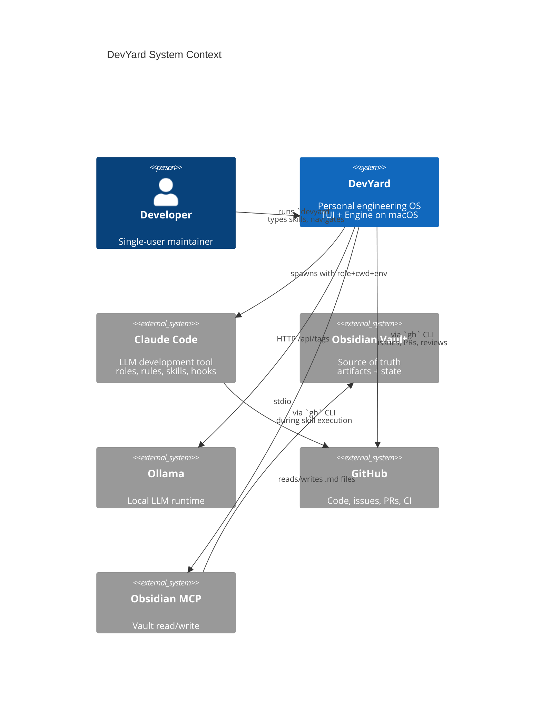

### 2.2 Container view (C4 Level 2)

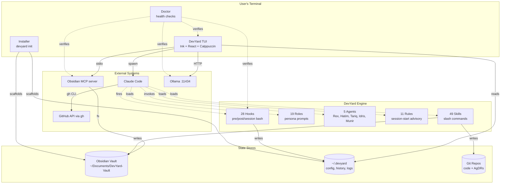

## 3. The Four-Layer Enforcement Model

DevYard's engine is built on four orthogonal layers. Each answers a different question and is enforced at a different time.

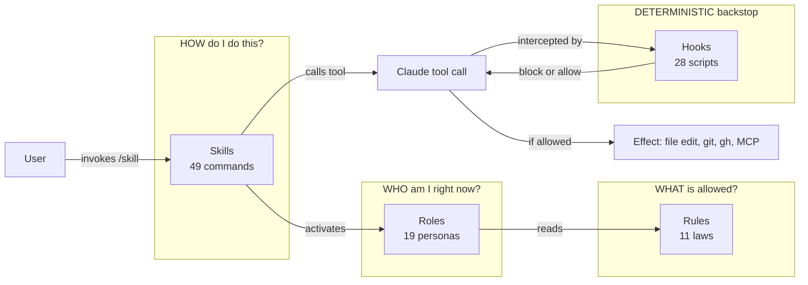

| Layer | Enforced by | When | Bypassable? |
|-------|-------------|------|-------------|
| Rules | Claude reading them | Session start (advisory) | Yes — Claude can ignore |
| Roles | Claude adopting persona | Skill invocation / trigger | Yes — Claude can resist |
| Skills | User invoking slash command | User-driven | N/A — user choice |
| Hooks | Claude Code harness | Tool call (deterministic) | Only by user override |

The point of this layering: **rules + roles** shape behavior gently for the 99% case. **Hooks** are the deterministic backstop that catches the 1% where the LLM drifts. **Skills** are the curated paths users actually take.

## 4. Component Inventory

### 4.1 DevYard CLI (Ink TUI)

User-facing process. Renders screens, manages input, dispatches actions, spawns Claude Code.

**Responsibilities:**

- Render UI in terminal using Ink + Catppuccin Mocha
- Scan vault and build in-memory project registry
- Maintain input box state, history, autocomplete
- Spawn Claude Code with correct cwd, env, role, skill
- Refresh data from MCP servers, Ollama, `gh`
- Display health from Doctor

**Non-responsibilities:** does not call LLMs directly, does not edit project files, does not perform git operations directly (delegated to Claude Code).

### 4.2 Obsidian Vault (the database)

Dedicated vault at user-configured path. Holds all persistent state and human-readable artifacts.

**Top-level structure:**

```
DevYard-Vault/
├── _System/
│   ├── config.md
│   ├── schemas/                   # JSON schemas for frontmatter
│   ├── templates/                 # template .md files
│   ├── override-log.md            # reviewer-override audit
│   └── ideas-backlog.md           # IDEA-NNN registry
├── _Inbox/                        # quick-capture
├── Projects/
│   └── <ProjectName>/
│       ├── README.md              # project home + frontmatter state
│       ├── BRDs/                  # /feature output
│       ├── Designs/               # /write-spec, /tech-vision
│       ├── Tasks/                 # /tasks output
│       ├── Sessions/              # session logs
│       ├── Decisions/             # AgDRs (mirrored from repo /docs/agdr/)
│       ├── investigations/        # /investigation live docs
│       ├── spike-memos/           # /spike-close DISCARD
│       ├── feature-inventory.md   # /extract-features output
│       ├── roadmap.md             # /roadmap output
│       └── handover-assessment.md # /handover output
├── Ideas/                         # promoted ideas
├── Decisions/                     # cross-project AgDRs
├── Handovers/                     # archived summaries
├── Roadmaps/                      # portfolio-level roadmaps
├── Stakeholder-Updates/           # /stakeholder-update output
└── Audit-History/                 # _lib-audit-history.sh output
```

### 4.3 MCP layer

Obsidian MCP server, spawned as subprocess. DevYard uses it for: reading recent ideas, writing frontmatter updates, listing vault contents.

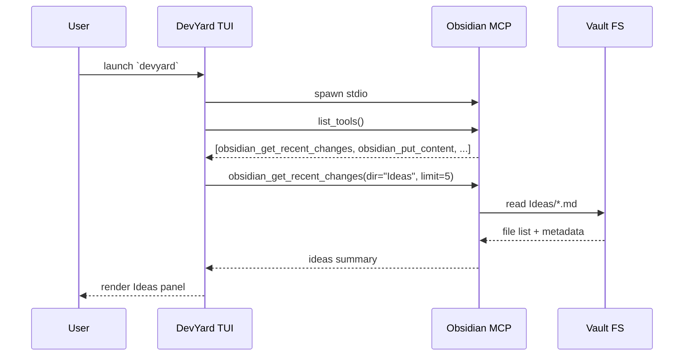

### 4.4 Ollama HTTP

Local LLM runtime queried only for status (which models are pulled, which are running). DevYard does not send prompts to Ollama; that responsibility belongs to Claude Code.

### 4.5 Claude Code (child process)

The LLM engine. Spawned via `execvp("claude", [...])` with environment that points it at the right cwd, role, and skill.

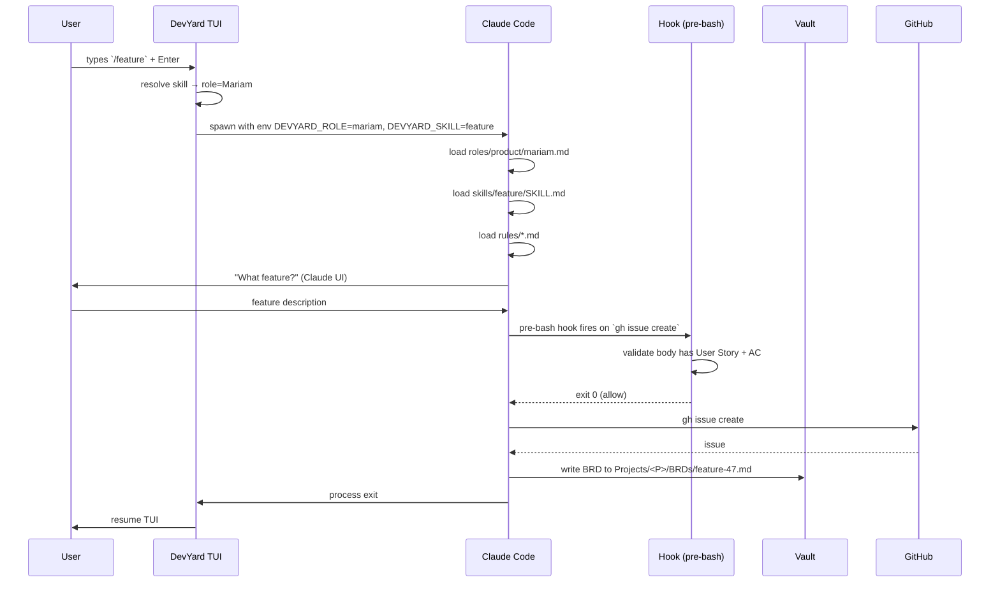

### 4.6 Agents (5 specialists)

Sub-Claude processes invoked by Claude Code via its Agent tool. Each has a restricted tool list and a focused persona.

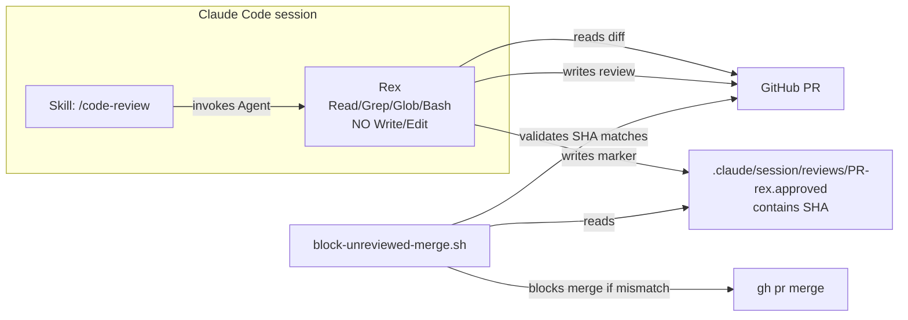

The five agents and their boundaries:

| Agent | Tools | Output | Can write code? |
|-------|-------|--------|-----------------|
| Rex (code review) | Read, Grep, Glob, Bash (read-only) | GitHub PR review + marker file with SHA | No |
| Hatim (security review) | Read, Grep, Glob, Bash (read-only) | GitHub PR review with CRITICAL/HIGH/MEDIUM/LOW | No |
| Tariq (PR manager) | Bash, Read, Grep, Glob | End-to-end PR coordination | No |
| Idris (ticket manager) | Bash, Read | GitHub issues with labels and structure | No |
| Munir (dep auditor) | Bash, Read, Grep, Glob | npm audit report + auto-created issues for Critical/High | No |

**Why agents can't write code:** separation of duties. A reviewer that could also edit code could approve its own changes. The hook chain enforces this: Rex's approval marker is only valid for the exact commit SHA it reviewed.

### 4.7 Hooks

28 deterministic shell scripts wired to Claude Code via `~/.claude/settings.json`. Fire on `PreToolUse`, `PostToolUse`, or `SessionStart`. Each hook returns exit 0 (allow), exit 2 (block with stderr message), or non-zero (error).

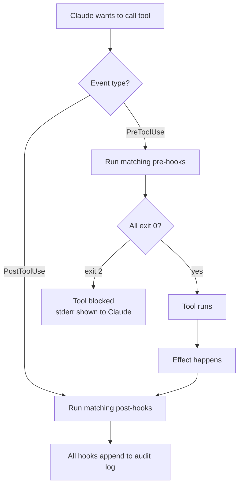

### 4.8 Doctor

Built-in TypeScript module invoked by `devyard doctor`. Runs every check, prints a colored checklist, exits 0 if all required pass.

### 4.9 Installer

Bash bootstrap (`install.sh`) + idempotent TypeScript subcommand (`devyard init`). Scaffolds everything required for a working DevYard environment.

## 5. Data Model

The vault holds nine entity types. Each is defined by frontmatter and lives in a folder convention.

| Entity | Folder | Type | Owner skill |
|--------|--------|------|-------------|
| Project | `Projects/<Name>/README.md` | `project` | `/handover`, `/setup` |
| BRD | `Projects/<Name>/BRDs/<feature>.md` | `brd` | `/feature`, `/write-spec` |
| Design | `Projects/<Name>/Designs/<feature>.md` | `design` | `/write-spec`, `/c4`, `/dfd` |
| AgDR | repo `/docs/agdr/AgDR-NNNN-slug.md` + vault `Decisions/` | `agdr` | `/decide` |
| Task list | `Projects/<Name>/Tasks/<feature>.md` | `tasks` | `/tasks` |
| Session | `Projects/<Name>/Sessions/<date>-<topic>.md` | `session` | every skill (auto) |
| Idea | `Ideas/<title>.md` | `idea` | `/idea`, `/validate-idea` |
| Handover | `Handovers/<project>-<date>.md` | `handover` | `/handover` |
| Roadmap | `Projects/<Name>/roadmap.md` | `roadmap` | `/roadmap` |
| Stakeholder update | `Stakeholder-Updates/<date>-<project>.md` | `update` | `/stakeholder-update` |
| Investigation | `Projects/<Name>/investigations/<slug>.md` | `investigation` | `/investigation` |
| Spike memo | `Projects/<Name>/spike-memos/<slug>.md` | `spike-memo` | `/spike-close` |
| Feature inventory | `Projects/<Name>/feature-inventory.md` | `feature-inventory` | `/extract-features` |
| Audit history | `Audit-History/<audit>-<date>.md` | `audit` | all 8 audit skills |

**Frontmatter schemas** are defined in JSON Schema files at `~/.devyard/schemas/`. Detailed in LLD §6.

## 6. Key Architectural Decisions (ADRs Summary)

Each summarized here; full ADRs live in `docs/decisions/`.

| ADR | Decision | Rationale |
|-----|----------|-----------|
| 0001 | Vault as single source of truth | Human-readable, version-controllable, iCloud-syncable, inspectable without DevYard |
| 0002 | TypeScript + Ink for TUI | Component model + React mental model fit panel layout; risk mitigated by perf kill-criterion |
| 0003 | Catppuccin Mocha locked theme | Removes a class of decisions, coherent surface, WCAG AA compliant |
| 0004 | Honor-system gates with structural validation | Gates are friction, not security; hooks enforce structure; semantic correctness is the reviewer's job |
| 0005 | DevYard never calls LLMs directly | All LLM work via Claude Code keeps the dependency at one layer |
| 0006 | macOS only for v1.0 | Reduces test surface; future portability not precluded |
| 0007 | Single repo (not monorepo) | Workspace overhead unjustified for solo project |
| 0008 | ESM-only, Node ≥ 20 | Modern; no CJS interop concerns |
| 0009 | pnpm package manager | Faster, stricter dependency hygiene than npm |
| 0010 | Tests for data layer only in v1.0 | Doctor is the integration test; UI snapshot testing deferred |
| 0011 | Agents have read-only tool access | Separation of duties; reviewers cannot approve own changes |
| 0012 | All hooks log to single audit file | Canary for silent breakage |
| 0013 | Frontmatter validators are deterministic, not LLM-based | Speed + reliability + reproducibility |
| 0014 | AgDR is mandatory for all arch decisions | Decision amnesia is the most expensive bug |
| 0015 | Ticket-first development | Required-active-ticket hook prevents drift from plan |
| 0016 | Force-push to main is deny-by-default | High-impact, low-frequency action gets explicit override |
| 0017 | Two-marker merge approval (Rex + human) | No autonomous merging; human always has final say |
| 0018 | Skills are markdown, not code | Editable, versionable, AI-readable |
| 0019 | Roles share project context | Persona differences are prompt-only, not isolated memory |
| 0020 | Catppuccin tokens accessed via semantic names | Future palette changes do not require codebase sweep |

## 7. Theme — Catppuccin Mocha (Locked)

### 7.1 Palette tokens

All UI references these names; never inline hex.

| Token | Hex | Purpose |
|-------|-----|---------|
| `base` | `#1e1e2e` | App background |
| `mantle` | `#181825` | Panel background |
| `crust` | `#11111b` | Outermost background |
| `text` | `#cdd6f4` | Primary body |
| `subtext1` | `#bac2de` | Secondary text |
| `subtext0` | `#a6adc8` | Tertiary / muted |
| `overlay2` | `#9399b2` | Disabled, placeholders |
| `overlay1` | `#7f849c` | Subtle borders |
| `overlay0` | `#6c7086` | Dividers |
| `surface2` | `#585b70` | Hover surfaces |
| `surface1` | `#45475a` | Selected backgrounds |
| `surface0` | `#313244` | Panel borders, input border |
| `rosewater` | `#f5e0dc` | Decorative |
| `flamingo` | `#f2cdcd` | Decorative |
| `pink` | `#f5c2e7` | Handover / parked highlight |
| `mauve` | `#cba6f7` | **Primary accent** |
| `red` | `#f38ba8` | Error / blocked |
| `maroon` | `#eba0ac` | Secondary error |
| `peach` | `#fab387` | In-progress |
| `yellow` | `#f9e2af` | Warning / draft |
| `green` | `#a6e3a1` | Success / approved |
| `teal` | `#94e2d5` | Code / commands |
| `sky` | `#89dceb` | Highlights |
| `sapphire` | `#74c7ec` | Info badges |
| `blue` | `#89b4fa` | Project names / links |
| `lavender` | `#b4befe` | Secondary accent |

### 7.2 Semantic role mapping

| Role | Token | Example use |
|------|-------|-------------|
| Brand / focus / selection | `mauve` | Selected project, input prompt `❯`, agent name in headers |
| Success / approved | `green` | Doctor pass `✓`, status: approved, Rex APPROVED |
| Warning / draft | `yellow` | Status: draft, optional check warning, stale review |
| Error / blocked | `red` | Doctor fail, hook block, CI red |
| Info | `sapphire` | Status badges, stage labels, version info |
| In progress | `peach` | Stage in progress, building, scanning |
| Parked / handover | `pink` | Parked projects, handover docs |
| Project name | `blue` | Every project name across the UI |
| Code / command | `teal` | Inline commands like `/feature`, file paths |
| Body | `text` | All readable body text |
| Muted | `subtext0` | Secondary metadata |
| Placeholder | `overlay2` | Input box placeholder |
| Background | `base` | App background |
| Panel | `mantle` | Each panel background |
| Border | `surface0` | All borders |
| Selected | `surface1` | Selected row background |
| Hover | `surface2` | Hover row background |

### 7.3 Iconography (Unicode only, no Nerd Fonts)

| Concept | Symbol |
|---------|--------|
| Project active | `●` |
| Project parked | `◌` |
| Project archived | `▢` |
| Status approved | `✓` |
| Status draft | `◐` |
| Status blocked | `✗` |
| Input prompt | `❯` |
| Selection | `▶` |
| Pass | `✓` |
| Fail | `✗` |
| Warn | `!` |
| Spinner frames | `⠋⠙⠹⠸⠼⠴⠦⠧⠇⠏` |
| Bullet | `•` |
| Arrow | `→` |

### 7.4 Layout primitives

- Panel borders: single-line, `surface0`, 1-char padding inside.
- Selected row: `surface1` bg, `text` fg, prefix `▶` in `mauve`.
- Input box: full-width, bordered, `❯` prompt in `mauve`, placeholder in `overlay2`.
- Status badges: 1-char icon + label, padded by single space, color from semantic mapping.

## 8. Data Flow Reference

### 8.1 Cold launch flow

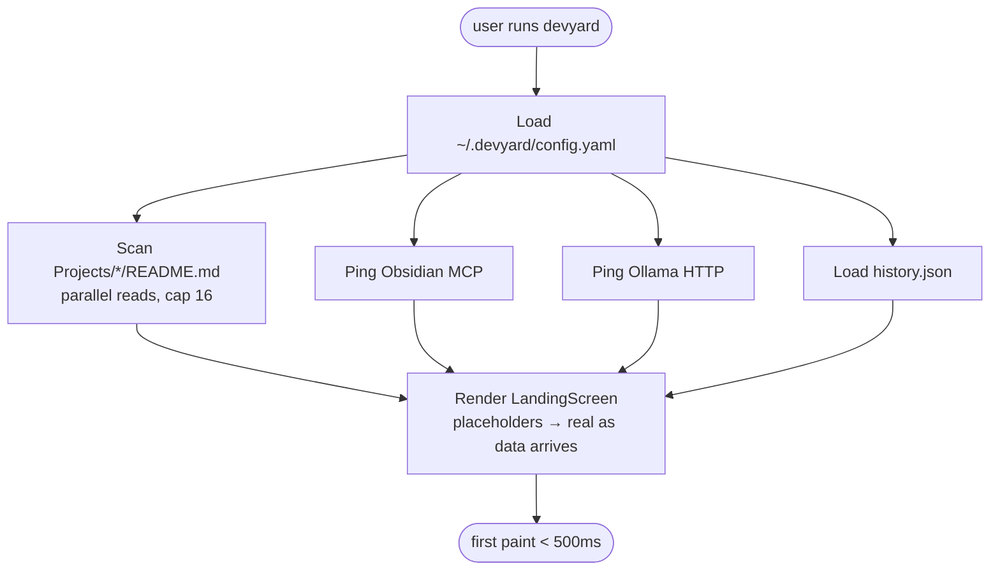

### 8.2 Input dispatch flow

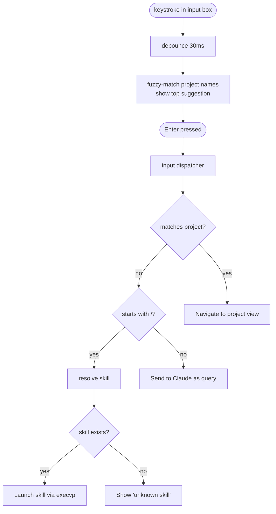

### 8.3 SDLC pipeline flow

```mermaid
flowchart LR
  IDEA[/idea/] --> VAL[/validate-idea/]
  VAL -->|GREEN/YELLOW| SPEC[/write-spec/]
  VAL -->|RED| ARCHIVE[archive]
  SPEC --> FEAT[/feature/]
  FEAT --> DEC[/decide/<br/>AgDR]
  DEC --> TASKS[/tasks/]
  TASKS --> START[/start-ticket/]
  START --> CODE[code + commits]
  CODE --> C4[/c4/]
  C4 --> DFD[/dfd/]
  DFD --> THREAT[/threat-model/]
  CODE --> PR[gh pr create]
  PR -->|auto| REVIEW[/code-review<br/>Rex/]
  REVIEW --> SECREV[/security-review<br/>Hatim/]
  SECREV --> DESIGN_APPROVE[/approve-design/]
  DESIGN_APPROVE --> CEO[/approve-merge/]
  CEO --> MERGE[gh pr merge]
  MERGE --> LAUNCH[/launch-check/]
  LAUNCH -->|GO| RELEASE[/release/]
  RELEASE --> MON[/monitoring-audit/]
  MON --> HANDOVER[/handover/]
```

### 8.4 Hook enforcement flow (`gh pr merge` example)

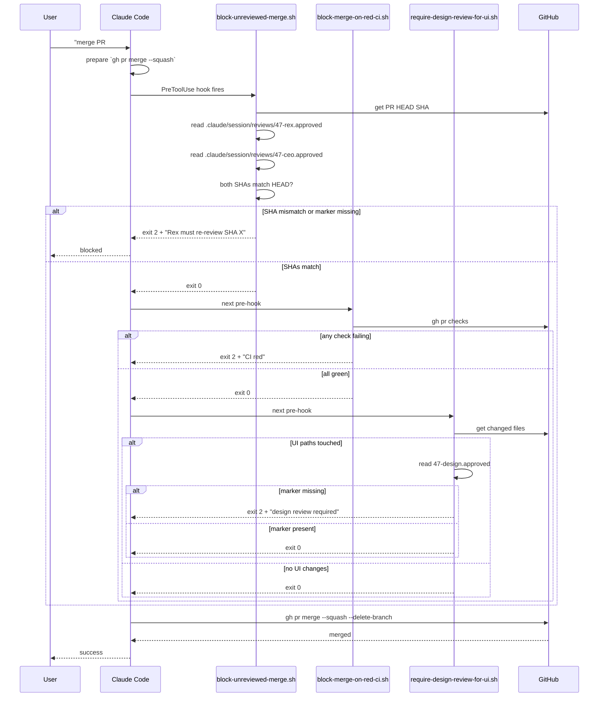

### 8.5 AgDR enforcement flow

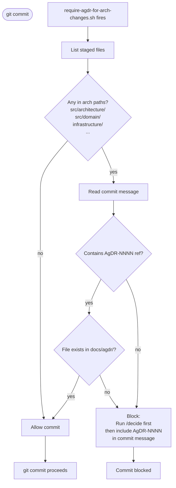

## 9. Performance Budget

| Operation | Budget | Strategy |
|-----------|--------|----------|
| Cold start to first paint | 500ms | Parallel I/O; render skeleton at 80ms, fill panels async |
| Vault scan (50 projects) | 100ms | Read only README.md per project; p-limit(16) concurrency |
| Keystroke → autocomplete | 50ms p95 | Trie of project names built at scan time |
| Project navigation | 200ms | Read full frontmatter + last 5 session filenames only |
| Skill launch | 500ms | `execvp` with pre-resolved paths; no shell wrap |
| Hook execution | 200ms p95 | Pure bash; avoid spawning python/jq unless cached |
| Doctor full | 5s | Parallel checks; cap per-check at 2s |
| Doctor --hooks-deep | 15s | Sequential synthetic-input firing of each hook |

## 10. Security Model

### 10.1 Threat model

1. **Accidental destruction** — force-push, branch delete, wrong-project commit.
2. **Secret leakage** — API keys / credentials committed to repo or written to vault.
3. **Prompt injection from MCP responses** — malicious content in a GitLab issue or Obsidian note tries to hijack Claude.
4. **Drift from process** — shortcuts in code review, missing AgDRs, unreviewed merges.

### 10.2 Controls per threat

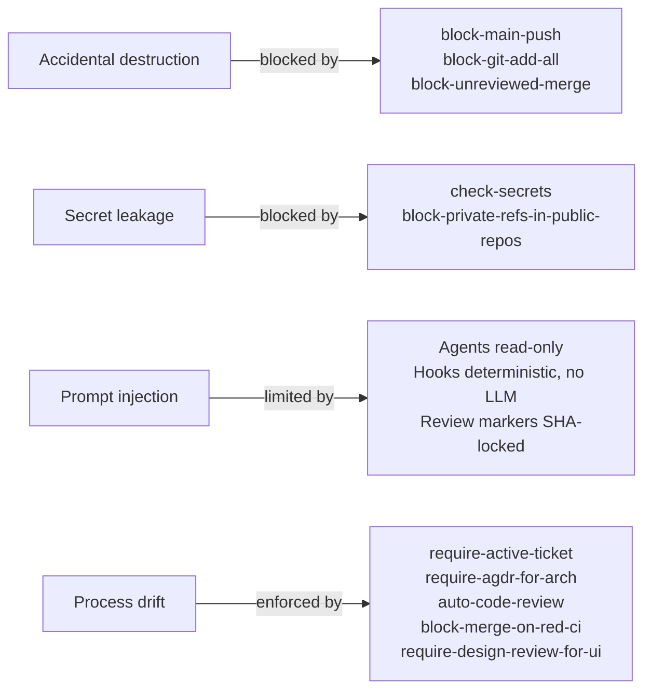

### 10.3 What is NOT a control

- Honor-system `status: approved` gates are friction, not security.
- Hooks can be disabled by the user (`devyard hooks disable <name>`); intentional.
- Rules are advisory; LLM may resist, hooks are the backstop.

## 11. Failure Modes and Recovery

| Failure | Behavior | Recovery |
|---------|----------|----------|
| Vault path missing | Doctor red; landing blocks until resolved | `devyard init` |
| Obsidian MCP unreachable | Ideas panel shows `! MCP unreachable` in yellow | Restart MCP; check env |
| Ollama unreachable | Status panel shows Ollama offline in yellow | `ollama serve` |
| Malformed project frontmatter | Project shown with `⚠` in yellow; clicking shows parse error | Fix frontmatter, re-scan |
| Hook script missing/non-exec | Doctor red on `hooks-exist`; affected op prompts user | `devyard init` to reinstall |
| Claude binary missing | Skill invocation fails red | Install Claude Code |
| History file corrupted | Quietly recreated empty | none — non-essential |
| GitHub rate limited | Inbox/projects/tasks panels degrade with warning | wait + retry |
| Hook silently broken | Discovered via `doctor --hooks-deep` or audit-log review | Reinstall hook |

## 12. Build Order

Phase A (Foundation) — Weeks 1–2: Doctor, Theme, MCP client, Vault scanner, Frontmatter, Installer skeleton, Schemas.

Phase B (Navigator) — Weeks 3–4: Ink scaffold, Theme integration, Landing screen (3 panels), Input box + dispatcher, Project view, History persistence.

Phase C (Engine) — Weeks 5–10:
- Week 5: Skill resolver + launcher + first 10 skills (`/status`, `/inbox`, `/projects`, `/tasks`, `/start-ticket`, `/feature`, `/bug`, `/task`, `/idea`, `/validate-idea`)
- Week 6: 19 roles + 5 agents (Rex, Hatim, Tariq, Idris, Munir) + 11 rules
- Week 7: 28 hooks + audit log + hooks-deep doctor mode
- Week 8: Next 12 skills (decision-related: `/decide`, `/agdr`, `/c4`, `/dfd`, `/threat-model`, `/tech-vision`, `/write-spec`, `/migration`, `/spike`, `/spike-close`, `/investigation`, `/tickets-batch`)
- Week 9: Next 12 skills (review + audits: `/code-review`, `/security-review`, `/approve-merge`, `/approve-design`, `/audit-deps`, `/launch-check`, `/accessibility-audit`, `/compliance-check`, `/analytics-audit`, `/seo-audit`, `/performance-audit`, `/monitoring-audit`)
- Week 10: Remaining 15 skills + 7 pipelines (`/docs-audit`, `/roadmap`, `/stakeholder-update`, `/release`, `/setup`, `/handover`, `/update`, `/split-portfolio`, `/extract-features`, `/debug`, `/cli-builder`, `/fan-out`, `/process`, `/journey`, `/onboard`-deprecated stub) + 7 CI YAML files

Phase D (Hardening) — Weeks 11–12: Performance pass, install on fresh machine, full doctor green, `/launch-check` on DevYard itself, documentation pass, v1.0 tag.

## 13. Future Extension Points

The architecture preserves seams for v1.1+:

- **Cross-platform:** path/process abstractions in `utils/` already isolate macOS-specific calls.
- **Team mode:** vault scanner is filterable by namespace; sharing a vault is one config flag away.
- **Web companion:** Engine layer is process-spawn-free at its boundaries; could be reused by a web UI.
- **Telemetry:** all hook fires and skill invocations are audit-logged; a future opt-in metric extractor can read this log.
- **Custom themes:** semantic-name indirection means swapping the palette file is a single-day task.

## 14. Glossary

(See BRD §13.)
